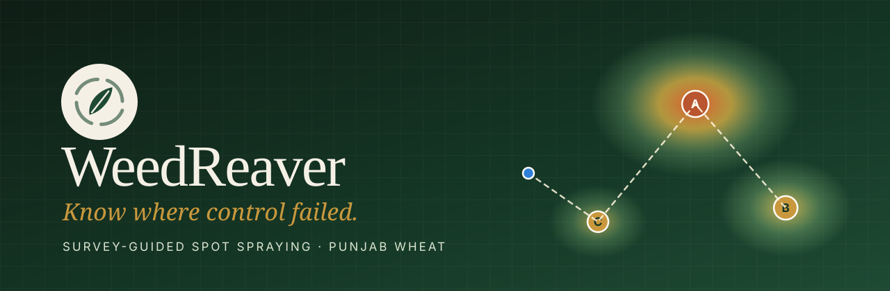
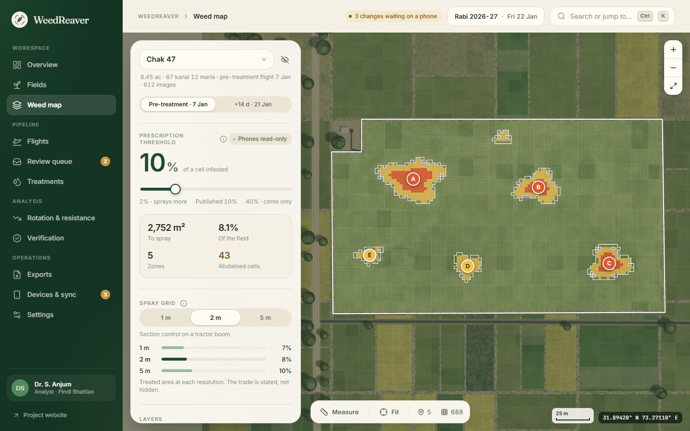
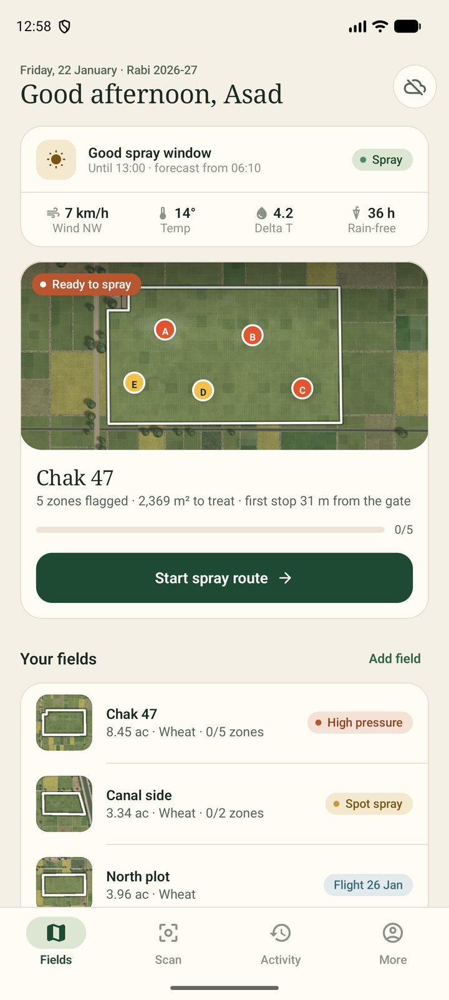
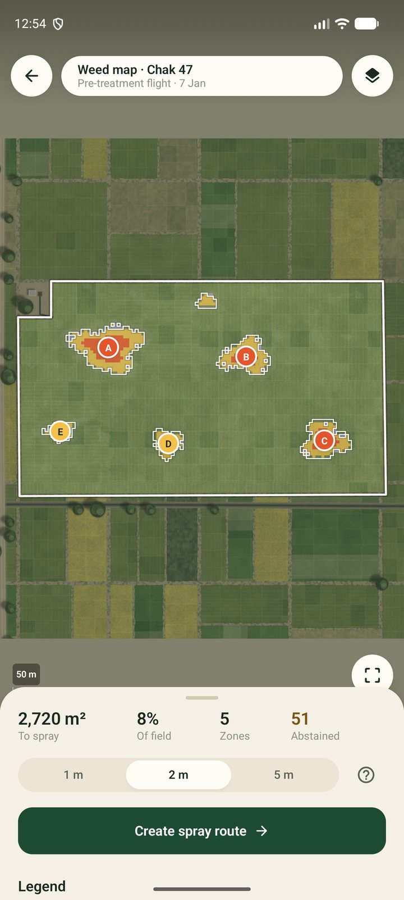
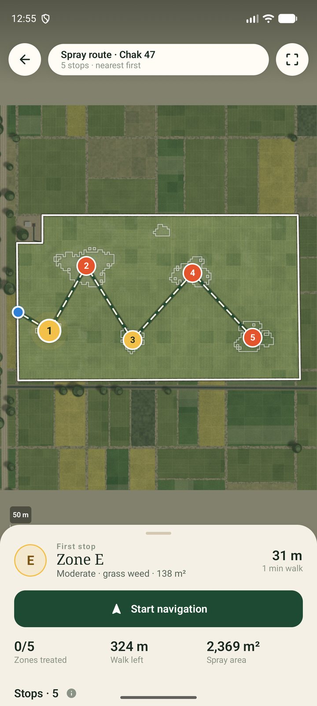
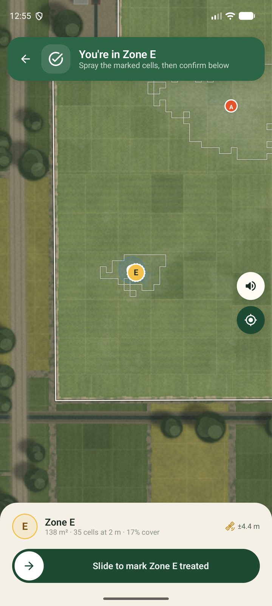
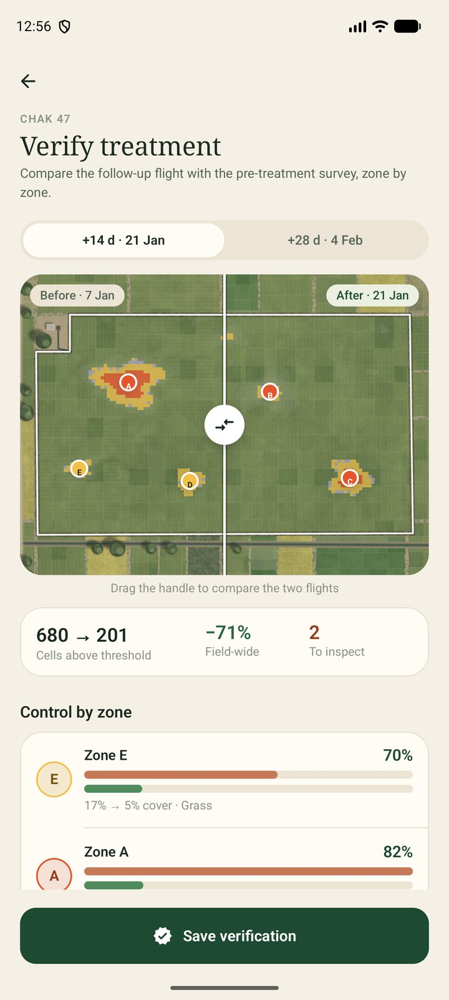
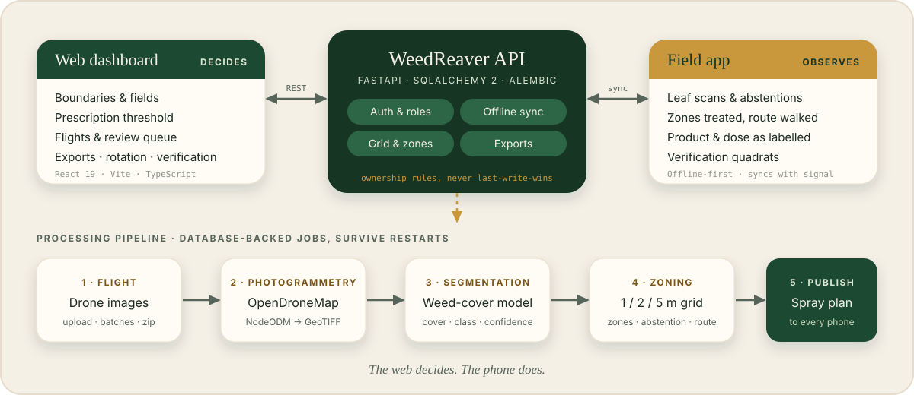
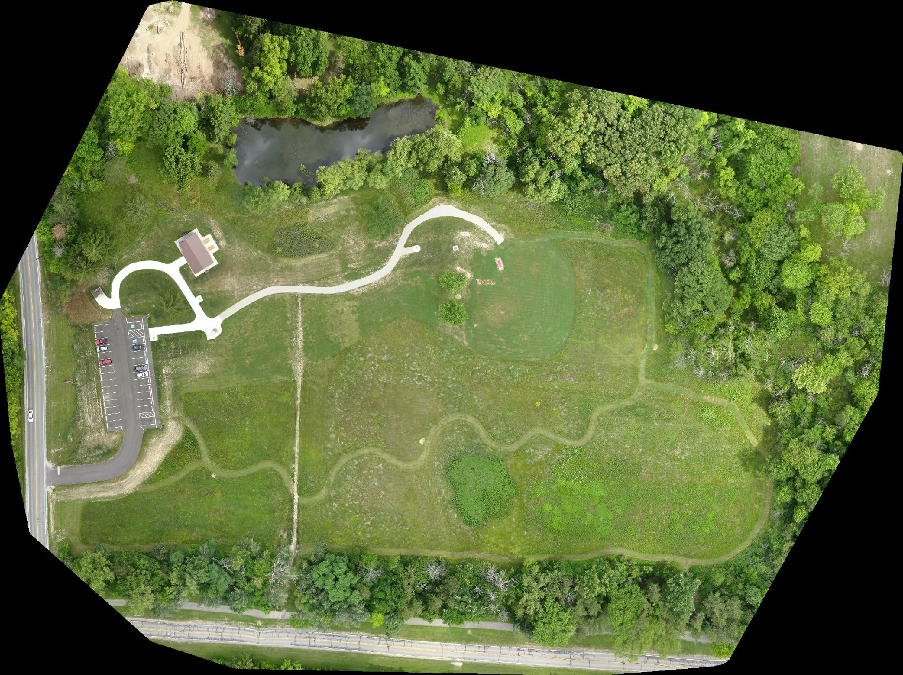
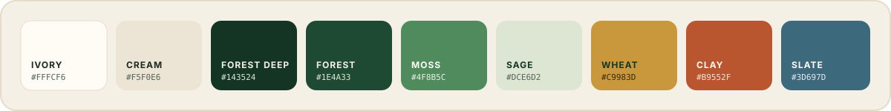

<div align="center">



<br>

[](backend/)
[](backend/)
[](web/)
[](web/)
[](#-from-drone-images-to-an-orthomosaic)
[](#-production)

**Survey-guided spot spraying for wheat.**
Fly the field, find where weeds survived, spray only those zones, then measure — per zone — whether the control worked.

[The idea](#-the-idea) · [Screens](#-screens) · [How it fits together](#-how-it-fits-together) · [Quick start](#-quick-start) · [Photogrammetry](#-from-drone-images-to-an-orthomosaic) · [API](#-the-api-at-a-glance) · [Design](#-design-language) · [License](#-license)

</div>

<br>

## 🌾 The idea

Blanket spraying treats a whole field for patches that cover a few percent of it, and a field-wide
average hides the one zone where the herbicide quietly stopped working. WeedReaver closes that loop:

<table>
<tr>
<td width="20%" align="center"><b>① Survey</b><br><sub>Drone flight over the field, stitched into a georeferenced orthomosaic</sub></td>
<td width="20%" align="center"><b>② Prescribe</b><br><sub>Weed cover becomes a 1 / 2 / 5 m grid and a handful of lettered spray zones</sub></td>
<td width="20%" align="center"><b>③ Treat</b><br><sub>Operators get an optimised route and mark each zone treated in the field</sub></td>
<td width="20%" align="center"><b>④ Record</b><br><sub>Product and dose are written down exactly as on the label</sub></td>
<td width="20%" align="center"><b>⑤ Verify</b><br><sub>A follow-up flight measures control <i>per zone</i> and flags resistance risk</sub></td>
</tr>
</table>

Three rules shape every screen and every endpoint:

> **The web decides, the phone does.** Definitions — boundaries, the prescription threshold, flights,
> review outcomes, exports — belong to the dashboard. Observations — scans, zones treated, products
> applied — belong to the phone. Sync settles conflicts by that ownership, never by last-write-wins.
>
> **Abstain, don't guess.** A cell or leaf scan the model is unsure about becomes a task for a person.
>
> **Measure the worst zone, not the average.** Efficacy is reported per zone; a field-wide mean is how
> a failing zone gets hidden.

<br>

## 🖼 Screens

<div align="center">

<br><sub><b>Weed map</b> — drag the threshold and watch the prescription, treated area and abstained cells recompute live, then publish it to every phone.</sub>
</div>

<br>

<div align="center">
<table>
<tr>
<td align="center"><br><sub>Spray window &amp; up next</sub></td>
<td align="center"><br><sub>Prescription on the phone</sub></td>
<td align="center"><br><sub>Optimised spray route</sub></td>
<td align="center"><br><sub>Slide to mark treated</sub></td>
<td align="center"><br><sub>Before / after, per zone</sub></td>
</tr>
</table>
<sub>The Android field app that pairs with this API (offline-first, built to work without signal) is developed separately and is not part of this repository.</sub>
</div>

<br>

## 🧭 How it fits together

<div align="center">

</div>

| Part | Where | What it is |
|---|---|---|
| **API** | [`backend/`](backend/) | FastAPI · SQLAlchemy 2 · Alembic · NumPy. Accounts and roles, fields and seasons, the processing pipeline, grids and zones, routes, review queue, treatments, rotation and resistance, verification, exports, devices, offline sync, audit trail. PostgreSQL in production, SQLite for local work. |
| **Dashboard** | [`web/`](web/) | React 19 · TypeScript · Vite · zustand · framer-motion. Overview, fields, weed map, flights, review queue, treatments, rotation, verification, exports, devices and settings, plus a public landing page. |
| **Docs** | [`docs/`](docs/) | Real OpenDroneMap output from a test run and the README artwork. |

### Highlights

- 🗺 **Live prescription.** The threshold slider re-runs the grid and zones as you drag; one tap publishes it to phones. A 1 m grid of the largest field (~35k cells) rasterises in about 0.2 s and is cached.
- 🧮 **Exact, reproducible analysis.** Grid, zones, abstention and routes are vectorised with NumPy and checked **bit-for-bit** against reference numbers from the dashboard's own TypeScript. Zone outlines are exact polygons (the union of their cells, holes included).
- 🛰 **Real photogrammetry.** [OpenDroneMap](https://github.com/OpenDroneMap/ODM) runs unmodified behind NodeODM; the backend only talks to it over HTTP.
- 🔌 **Pluggable models.** Orthomosaic and segmentation are interfaces — choose an implementation with one environment variable. Simulated engines make the whole loop work today.
- 🔁 **Offline sync that respects ownership.** Idempotent pushes (`applied` / `duplicate` / `rejected`), cursor-based pulls, rotating refresh tokens that survive weeks without signal.
- 📤 **Real exports.** GeoJSON, Shapefile and ISO 11783-10 TASKDATA for tractor terminals.
- 🧪 **Resistance-aware.** Mode-of-action (HRAC) history per field, a clash warning *before* a record is written, and per-zone control trend.
- 🔐 **Careful by default.** Argon2 password hashing, short-lived access tokens, refresh-token reuse detection that revokes the session family, rate limiting, request-scoped logging, and a production boot that refuses the default secret.

<br>

## 🚀 Quick start

You need **Python 3.11+** and **Node 20+**.

**1 · The API**

```bash
cd backend
python -m venv .venv
.venv/Scripts/pip install -r requirements-dev.txt      # macOS/Linux: .venv/bin/pip
cp .env.example .env                                   # Windows: copy .env.example .env
.venv/Scripts/python -m app.cli seed-demo              # loads the demonstration station
.venv/Scripts/uvicorn app.main:app --reload
```

Interactive docs live at <http://localhost:8000/api/v1/docs>. To make the demo's dates line up, set
`WR_DEMO_CLOCK_DATE=2027-01-22` in `backend/.env` (development only — production refuses to start with it).

**2 · The dashboard**

```bash
cd web
npm install
npm run dev          # http://localhost:5173
```

**3 · Sign in**

All demo accounts use the password `weedreaver-demo`.

| Role | Email | Can |
|---|---|---|
| Analyst | `s.anjum@pindibhattian-station.pk` | Decide: thresholds, flights, review, exports |
| Admin | `m.rauf@pindibhattian-station.pk` | Everything, including users and audit |
| Operator | `a.mehmood@pindibhattian-station.pk` | Observe in the field |
| Trainee | `trainee.0212@pindibhattian-station.pk` | Observe, North plot only |

> The dashboard reads the API address from `VITE_API_BASE_URL` (default `http://localhost:8000/api/v1`),
> and the API must list the dashboard's origin in `WR_CORS_ORIGINS`. Both defaults already match.

**Tests**

```bash
cd backend && .venv/Scripts/python -m pytest      # 70+ API and engine tests (SQLite by default)
cd web     && npm test                            # client, adapters, geometry, infestation model
cd web     && npm run build                       # type-check + production bundle
```

Set `WR_TEST_POSTGRES_URL` to run the backend suite against PostgreSQL.

<br>

## 🛰 From drone images to an orthomosaic

Processing runs `photogrammetry → segmentation → zoning` as a **database-backed job** — it survives
restarts, retries transient failures, and several workers can run side by side.

<div align="center">

<br><sub>A real orthomosaic from the pipeline: ODM's 77-image sample, stitched in 9.4 minutes into a 266 MB GeoTIFF at 2.39 cm/px covering 360 × 269 m.</sub>
</div>

<br>

```bash
docker run -d --name nodeodm -p 3000:3000 opendronemap/nodeodm
```

```ini
# backend/.env
WR_ORTHOMOSAIC_ENGINE=app.pipeline.orthomosaic:NodeODMOrthomosaicEngine
WR_NODEODM_URL=http://localhost:3000
```

What `NodeODMOrthomosaicEngine` does for you:

- Uploads images in parallel with per-file retries, and tunes ODM for a nadir, fixed-altitude flight over flat wheat (`fast-orthophoto`, `sfm-algorithm planar`, `cog`, `skip-3dmodel`, …). Override anything with `WR_ODM_OPTIONS`.
- Streams ODM's progress onto the flight, downloads **only** the orthophoto, and verifies it is a georeferenced GeoTIFF (size, pixel size, origin and EPSG read without GDAL).
- Re-attaches to a running task after a crash instead of uploading again, and falls back once to a slower SfM algorithm if the fast run fails — with failures phrased as causes ("ran out of memory…", "too few images…").
- Keeps heavy data local: flights are gigabytes, so run NodeODM on the machine that holds the images.

**Bring your own segmentation model.** Implement `ModelSegmentationEngine.segment` in
[`backend/app/pipeline/segmentation.py`](backend/app/pipeline/segmentation.py) and return per-pixel weed
cover, class map (crop / grass weed / broadleaf weed) and confidence. Grids, abstention, zones with stable
letters, routes, efficacy and exports all work on it unchanged.

<br>

## 🏭 Production

```bash
cd backend
docker compose up -d --build
docker compose run --rm api python -m app.cli create-admin --email you@station.pk --name "Your Name"
```

The stack is **PostgreSQL**, a one-shot **bootstrap** (migrations, station settings, label list, species),
the **API** (two processes), a standalone **processing worker** and **NodeODM**. Set `WR_SECRET_KEY` and
`POSTGRES_PASSWORD` in `.env` first, put a TLS-terminating proxy in front with a body limit large enough for
flight batches (e.g. nginx `client_max_body_size 1g;`). `GET /health` is liveness; `GET /ready` checks the database.

<br>

## 🔌 The API at a glance

Base path `/api/v1` · camelCase JSON · ISO 8601 UTC timestamps · errors as `{"error": {"code", "message", "details"}}`.

| Area | Endpoints |
|---|---|
| **Auth** | `POST /auth/login` · `/auth/refresh` · `GET /auth/me` — 15-minute access tokens, rotating 60-day refresh tokens |
| **Fields** | `GET /fields` · `POST /fields/parse-boundary` (GeoJSON / KML / CSV) · `GET /fields/{id}/grid?size=&threshold=` |
| **Prescription** | `GET /fields/{id}/zones` · `/zones/preview?threshold=` · `PUT /settings/threshold` · `GET /fields/{id}/route` |
| **Flights** | `POST /surveys` → `POST /surveys/{id}/images` → `POST /surveys/{id}/process` |
| **Review** | `GET /scans?status=NEEDS_LABEL` · `POST /scans/{id}/resolve` |
| **Treatments** | `GET /treatments` · `POST /treatments` · `POST /rotation/check` · `GET /fields/{id}/rotation` |
| **Verification** | `GET /fields/{id}/verification?role=PLUS_14D` |
| **Exports** | `POST /exports/preview` · `POST /exports` · `GET /exports/{id}/download` |
| **Sync** | `POST /sync/push` · `GET /sync/pull?since=` · `GET /devices` |

The grid is **columnar** to stay small — a 1 m grid is ~35k cells and about 50 KB gzipped. The full
integration guide, with every endpoint by screen, sync payloads and error codes, is in
[`backend/README.md`](backend/README.md).

<br>

## 🎨 Design language

The dashboard and the field app share one palette and one set of type: warm cream grounds with a deep
forest primary, wheat-ochre and clay for status, drawn from the same earth tones as the imagery.
**Never pure white** — it is designed to be read in sunlight.

<div align="center">

</div>

<br>

| | |
|---|---|
| **Serif display** | [Fraunces](https://fonts.google.com/specimen/Fraunces) for headings |
| **Sans body** | [Inter](https://rsms.me/inter/), tabular figures for every number |
| **Mono** | [JetBrains Mono](https://www.jetbrains.com/lp/mono/) for coordinates and ids |
| **Heat ramp** | <code>#9BD08A</code> low → <code>#F3C04A</code> mid → <code>#E4552D</code> high, with <code>#A7A3C4</code> reserved for *abstained* |
| **Motion** | Emphasised easing for navigation, springs for anything touched, press-scale instead of ripples |

Tokens live in [`web/src/styles/tokens.css`](web/src/styles/tokens.css).

<br>

## 🗂 Repository layout

```
backend/                FastAPI service
  app/
    api/                dependencies and one router per area
    analysis/           weed surfaces, rasterising to 1/2/5 m, zones, polygons, efficacy, cache
    pipeline/           engine contracts, ODM + simulated engines, job runner, worker
    services/           all business rules (routes stay thin)
    models/ schemas/    ORM and wire types
    domain/             enums, geometry, KML / GeoJSON / CSV parsing
    core/               config, clock, errors, security, rate limiting, logging
    seed/               the demonstration dataset
  alembic/              migrations
  tests/                API, sync, ODM and analysis tests
  docker-compose.yml    PostgreSQL + API + worker + NodeODM

web/                    React dashboard
  src/api/              API client (auth, token rotation, error envelope) and wire types
  src/data/             store, query cache, adapters, geometry, infestation model
  src/map/              canvas map, camera, worker-rendered aerial imagery, overlays
  src/pages/            one file per route, with its own stylesheet
  src/styles/           design tokens, base, components
  src/ui/               app shell, design-system kit, charts, brand

docs/                   README artwork and an OpenDroneMap sample run
```

<br>

## ⚖️ What is real, and what is simulated

**Real:** accounts, sessions and roles · every geometry, area, grid, zone, route and efficacy figure ·
the review loop · treatment and rotation records · offline sync with ownership rules · audit and sync
ledgers · GeoJSON, Shapefile and ISO 11783-10 exports · uploads and storage · the job pipeline ·
photogrammetry through OpenDroneMap.

**Simulated until you plug in a model:** aerial segmentation (the simulated engine is the default, so demos
and tests need no GPU or ODM node), leaf inference (runs on the phone), and weather (static unless
`WR_WEATHER_PROVIDER=open-meteo`).

The dashboard's aerial imagery is rendered procedurally in Web Workers from each parcel's geometry — a stand-in
that real raster tiles can replace without touching any page.

<br>

## 🙏 Acknowledgements

Photogrammetry is powered by [OpenDroneMap](https://github.com/OpenDroneMap/ODM), which runs in its own container
under its own licence (AGPL-3.0); this project only talks to it over HTTP. The sample orthomosaic in
`docs/odm-sample-run/` comes from ODM's public sample dataset.

## 📄 License

Released under the [MIT License](LICENSE).

<div align="center">
<br>
<sub>Built for wheat growers who would rather spray 8% of the field than all of it.</sub>
</div>
